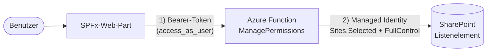

# Azure Function von Grund auf – Schritt für Schritt

> Ziel: Du sitzt vor einem **leeren Ordner** und baust daraus von Hand eine Azure Function –
> ohne KI, so wie du es bei einem SPFx-Web-Part längst kannst. Als Beispiel bauen wir die
> `ManagePermissions`-Lösung in **TypeScript/Node.js**
> mit **PnPjs** nach.
>
> Diese Anleitung setzt **keine** Vorkenntnisse über Azure Functions voraus. Sie ist zum
> **Mitmachen** gedacht: Arbeite sie von oben nach unten durch und tippe den Code selbst.

## Inhalt

1. [Was wir bauen](#was-wir-bauen)
2. [Denkmodell: SPFx-Web-Part ↔ Azure Function](#denkmodell-spfx-web-part--azure-function)
3. [Voraussetzungen](#voraussetzungen)
4. [Schritt 1 – Leerer Ordner wird zum Function-Projekt](#schritt-1--leerer-ordner-wird-zum-function-projekt)
5. [Schritt 2 – Den ersten HTTP-Endpunkt anlegen und lokal starten](#schritt-2--den-ersten-http-endpunkt-anlegen-und-lokal-starten)
6. [Schritt 3 – Abhängigkeiten und Projektstruktur](#schritt-3--abhängigkeiten-und-projektstruktur)
7. [Schritt 4 – Der Eingabe-Vertrag (Modell)](#schritt-4--der-eingabe-vertrag-modell)
8. [Schritt 5 – Aufrufer prüfen: das JWT im Code validieren](#schritt-5--aufrufer-prüfen-das-jwt-im-code-validieren)
9. [Schritt 6 – SharePoint-Zugriff mit PnPjs (app-only)](#schritt-6--sharepoint-zugriff-mit-pnpjs-app-only)
10. [Schritt 7 – Alles im HTTP-Handler verdrahten](#schritt-7--alles-im-http-handler-verdrahten)
11. [Schritt 8 – Entra-App-Registrierung + Sicherheitsgruppe](#schritt-8--entra-app-registrierung--sicherheitsgruppe)
12. [Schritt 9 – Lokal testen](#schritt-9--lokal-testen)
13. [Schritt 10 – Nach Azure deployen](#schritt-10--nach-azure-deployen)
14. [Schritt 11 – Managed Identity berechtigen (Sites.Selected)](#schritt-11--managed-identity-berechtigen-sitesselected)
15. [Schritt 12 – End-to-End testen](#schritt-12--end-to-end-testen)
16. [C# vs. TypeScript – gegenübergestellt](#c-vs-typescript--gegenübergestellt)
17. [Troubleshooting](#troubleshooting)
18. [Zusammenfassung](#zusammenfassung)

---

## Was wir bauen

Eine HTTP-Function mit **einem** Endpunkt `POST /api/ManagePermissions`. Sie setzt oder
entfernt Berechtigungen auf **einem einzelnen SharePoint-Listenelement** – aufgerufen aus
einem SPFx-Web-Part.

Es gibt **zwei Vertrauensgrenzen**, und sie nutzen **zwei verschiedene Identitäten**:



1. **Aufrufer → Function = delegated.** Das Web-Part schickt ein Entra-ID-Benutzertoken.
   Die Function **validiert dieses JWT im Code** (Signatur, Issuer, Audience, Gültigkeit),
   prüft den Scope `access_as_user` und die Mitgliedschaft in einer Sicherheitsgruppe.
2. **Function → SharePoint = app-only.** Die Function greift über die **Managed Identity**
   der Function App auf SharePoint zu – mit **least privilege** (`Sites.Selected` +
   `FullControl` nur auf der Ziel-Site). Der Aufrufer selbst braucht **keine**
   Site-Admin-Rechte. Das ist die „kontrollierte Rechte-Erhöhung".

> Genau dieselbe Architektur wie die C#-`ManagePermissions` – nur in TypeScript.

---

## Denkmodell: SPFx-Web-Part ↔ Azure Function

Wenn du SPFx kennst, kennst du den Ablauf bereits – nur die Werkzeuge heißen anders:

| Was du bei SPFx tust | Entsprechung bei Azure Functions |
|---|---|
| `yo @microsoft/sharepoint` (Projekt scaffolden) | `func init` (Projekt scaffolden) |
| Web-Part-Komponente hinzufügen | `func new` (Function/Trigger hinzufügen) |
| `gulp serve` (lokaler Workbench) | `func start` (lokaler Functions-Host auf `localhost:7071`) |
| `config/package-solution.json` (Bundle-Metadaten) | `host.json` (App-weite Konfiguration) |
| `.sppkg` in den App-Katalog hochladen | `func azure functionapp publish` (Code in die Function App) |
| `webApiPermissionRequests` im Manifest | Entra-App-Registrierung + `Sites.Selected`-Grant |
| Properties im Property-Pane | **App Settings** (Umgebungsvariablen) |
| `SPHttpClient` / `AadHttpClient` | **PnPjs** + `DefaultAzureCredential` |

Kernunterschied: Ein SPFx-Web-Part läuft **im Browser des Benutzers** und nutzt dessen
Identität. Eine Function läuft **serverseitig in Azure** und braucht eine **eigene**
Identität (die Managed Identity), um auf SharePoint zuzugreifen.

---

## Voraussetzungen

### Werkzeuge (einmalig installieren)

| Werkzeug | Version | Zweck |
|---|---|---|
| **Node.js** | 22 LTS | Laufzeit + `npm`. Die Function App läuft später auf Node 22. |
| **Azure Functions Core Tools** | 4.x | Die `func`-CLI: Projekt anlegen, lokal starten, deployen. |
| **Azure CLI** | 2.60+ | Azure-Ressourcen anlegen; `az login` (lokal nutzt die Function deine CLI-Anmeldung). |
| **Git** | – | Versionsverwaltung. |
| **Azurite** | – | Lokaler Storage-Emulator – der Functions-Host braucht einen Storage-Account, auch lokal. |
| **VS Code** + Azure Functions Extension | – | Optional, aber bequem für Debugging und Deployment. |
| **PnP.PowerShell** + `Microsoft.Graph` (PS) | – | Nur für [Schritt 11](#schritt-11--managed-identity-berechtigen-sitesselected) (MI berechtigen). |

```powershell
# Windows-Installation (einmalig)
winget install --id OpenJS.NodeJS.LTS -e
winget install --id Microsoft.AzureCLI -e
winget install --id Microsoft.Azure.FunctionsCoreTools -e
npm install -g azurite

# Kontrolle
node --version      # v22.x
func --version      # 4.x
az --version        # azure-cli 2.6x
```

> Alternativ lassen sich die Core Tools über npm installieren:
> `npm install -g azure-functions-core-tools@4 --unsafe-perm true`.

### Konten & Rollen

- **Azure-Subscription** mit **Contributor**-Rechten (Ressourcen + Function App anlegen).
- **Entra-Tenant-Admin** – einmalig für den Admin-Consent von `Sites.Selected`.
- **SharePoint-Administrator** – um der Managed Identity die Ziel-Site freizugeben (und
  ggf. die API-Berechtigung des SPFx-Web-Parts zu genehmigen).

---

## Schritt 1 – Leerer Ordner wird zum Function-Projekt

Lege einen leeren Ordner an und mache ihn zum Function-Projekt. Das ist das `func`-Gegenstück
zu `yo @microsoft/sharepoint`:

```powershell
mkdir managepermissions-ts
cd managepermissions-ts
git init
func init --worker-runtime node --language typescript
```

> **Was bedeutet `--worker-runtime`?** Sie legt fest, in welcher Sprache du deine Functions
> schreibst – also welche Sprach-„Laufzeit" der Functions-Host startet. Für jede Sprache gibt
> es eine eigene. Nur informativ, die möglichen Werte:
>
> | `--worker-runtime` | Sprache |
> |---|---|
> | `node` | JavaScript/TypeScript (über `--language javascript` bzw. `typescript`) ← wir |
> | `python` | Python |
> | `powershell` | PowerShell |
> | `dotnet-isolated` | C#/F# im isolierten Worker-Prozess (aktueller .NET-Standard) |
> | `dotnet` | C#/F# „in-process" (älteres Modell, läuft aus) |
> | `java` | Java (in der Praxis meist über das Maven-Tooling) |
> | `custom` | „Custom Handler" – beliebige Sprache (z. B. Go, Rust), die über HTTP spricht |
>
> Die produktive `ManagePermissions` nutzt `dotnet-isolated`; wir nehmen hier `node`.

`func init` legt das Projektgerüst an. **Diese Dateien entstehen – und das bedeuten sie:**

| Datei | Bedeutung |
|---|---|
| `host.json` | App-weite Konfiguration (gilt für **alle** Functions). Pendant zu `package-solution.json`. |
| `local.settings.json` | Deine **lokalen** App Settings/Geheimnisse. Wird **nicht** deployt (steht in `.gitignore`). |
| `package.json` | npm-Abhängigkeiten + Scripts. Das Feld `main` sagt dem Host, **wo deine Functions registriert werden**. |
| `tsconfig.json` | TypeScript-Compiler-Optionen. Kompiliert `src/**/*.ts` → `dist/`. |
| `.funcignore` | Was **nicht** mit deployt wird (analog `.gitignore`). |
| `.gitignore` | Schließt u. a. `local.settings.json`, `node_modules`, `dist` aus. |

Wirf einen Blick in `package.json` – wichtig ist das `main`-Feld:

```jsonc
{
  "main": "dist/src/{index.js,functions/*.js}",
  "scripts": {
    "build": "tsc",
    "start": "func start",
    "prestart": "npm run clean && npm run build",
    "clean": "rimraf dist"
  },
  "dependencies": {
    "@azure/functions": "^4.5.0"
  }
}
```

> **Was heißt „v4-Programmiermodell"?** „Programmiermodell" meint die Art und Weise, **wie
> du deine Functions im Code schreibst** – welche Datei-Struktur und welche Befehle du nutzt,
> um dem Host zu sagen „hier ist eine Function". Für Node.js gibt es davon mittlerweile die
> **vierte Generation** (v4), gebunden an das npm-Paket `@azure/functions` (Version 4). Sie
> ist der aktuelle Standard und besonders einsteigerfreundlich: Du beschreibst eine Function
> **direkt im Code** mit `app.http(...)` – mehr dazu gleich im nächsten Schritt. (Nur als
> Randnotiz, falls dir online ältere Beispiele begegnen: Früher lag neben jeder Function eine
> separate `function.json`-Datei; im v4-Modell brauchst du sie nicht mehr.)

---

## Schritt 2 – Den ersten HTTP-Endpunkt anlegen und lokal starten

Füge eine HTTP-Function hinzu. Das ist das Gegenstück zu „Web-Part-Komponente hinzufügen":

```powershell
func new --name ManagePermissions --template "HTTP trigger" --authlevel anonymous
```

Es entsteht `src/functions/ManagePermissions.ts` mit einer „Hello world"-Function:

```typescript
import { app, HttpRequest, HttpResponseInit, InvocationContext } from "@azure/functions";

export async function ManagePermissions(
    request: HttpRequest,
    context: InvocationContext
): Promise<HttpResponseInit> {
    context.log(`Http function processed request for url "${request.url}"`);
    const name = request.query.get("name") || (await request.text()) || "world";
    return { body: `Hello, ${name}!` };
}

app.http("ManagePermissions", {
    methods: ["GET", "POST"],
    authLevel: "anonymous",
    handler: ManagePermissions,
});
```

> **Was bedeutet „die Function registrieren"?** Der Aufruf `app.http(...)` ist die
> **Anmeldung deiner Function beim Functions-Host**. Du sagst ihm damit beim Start drei Dinge:
> *Wie heißt die Function?* (`"ManagePermissions"`), *worauf reagiert sie?* (hier: HTTP-Aufrufe
> mit `GET`/`POST`) und *welche Funktion soll laufen, wenn ein Aufruf kommt?*
> (`handler: ManagePermissions`). Beim Start liest der Host alle Dateien aus dem `main`-Feld
> der `package.json`, führt diese `app.http(...)`-Aufrufe aus und weiß danach, welche
> Endpunkte es gibt und wohin er eingehende Anfragen leiten muss. „Registrieren" heißt also
> schlicht: **dem Host die Function bekannt machen**. (In C# erledigt das die Zeile
> `[Function("…")]` über der Methode – dieselbe Idee, andere Schreibweise.)

> **Was bedeutet `authLevel` – und welche Werte gibt es?** Das `authLevel` steuert, ob der
> Aufrufer einen **Function-Schlüssel** (einen von Azure generierten geheimen Key) mitschicken
> muss, um den Endpunkt überhaupt zu erreichen. Drei Werte sind möglich:
>
> | `authLevel` | Bedeutung | Wann |
> |---|---|---|
> | `anonymous` | Kein Schlüssel nötig – jeder darf die URL aufrufen. | Wenn du die Zugangsprüfung **selbst** machst (wie hier per Entra-Token) oder ein vorgelagerter Türsteher schützt (API Management, App Service Authentication). |
> | `function` | Ein **Function-/Host-Schlüssel** muss mit (Header `x-functions-key` oder `?code=…`). Der Standard. | Einfacher Schutz für interne oder Service-zu-Service-Aufrufe, bei denen sich ein geteilter Schlüssel verteilen lässt. |
> | `admin` | Der **Master-Schlüssel** der Function App ist nötig (sehr weitreichend). | Selten, nur für administrative Endpunkte – möglichst meiden. |
>
> **Warum hier `anonymous`?** Wir prüfen die Identität des Aufrufers **selbst im Code**
> (Entra-Token + Gruppenmitgliedschaft). Ein zusätzlicher Function-Schlüssel würde die
> Token-Logik nur verdoppeln, ohne mehr Sicherheit zu bringen. Wichtig: `anonymous` heißt
> **nicht** „ungeschützt" – nur „kein Azure-Schlüssel"; unser JWT-Check in Schritt 5 ist der
> eigentliche Türsteher.

### Lokal starten

```powershell
npm install        # holt @azure/functions etc.
npm start          # kompiliert (tsc) und startet den Functions-Host
```

Am Ende der Ausgabe erscheint:

```
Functions:
        ManagePermissions: [GET,POST] http://localhost:7071/api/ManagePermissions
```

In einem **zweiten** Terminal testen:

```powershell
Invoke-RestMethod "http://localhost:7071/api/ManagePermissions?name=Workshop"
# -> Hello, Workshop!
```

**Meilenstein erreicht:** Eine Azure Function läuft lokal. Ab hier ersetzen wir nur noch die
Logik – das Gerüst steht.

> Falls beim Start eine Storage-Warnung kommt: Starte in einem Terminal `azurite` (oder
> setze in `local.settings.json` `"AzureWebJobsStorage": "UseDevelopmentStorage=true"`).

---

## Schritt 3 – Abhängigkeiten und Projektstruktur

Jetzt installieren wir die Bibliotheken für die echte Logik:

```powershell
npm install @azure/identity @pnp/sp @pnp/nodejs @pnp/azidjsclient jose
```

| Paket | Wofür |
|---|---|
| `@azure/identity` | Liefert `DefaultAzureCredential` – in Azure = Managed Identity, lokal = deine `az login`-Anmeldung. |
| `@pnp/sp` | PnPjs-Kern für den SharePoint-Zugriff (`spfi`, Webs, Listen, Items, Security). |
| `@pnp/nodejs` | Node-spezifische PnPjs-Bausteine (`SPDefault` = fetch-Client + Default-Verhalten). |
| `@pnp/azidjsclient` | Brücke zwischen `@azure/identity` und PnPjs (das `AzureIdentity`-Behavior). |
| `jose` | Schlanke, moderne Bibliothek zur **JWT-Validierung** (Signaturprüfung gegen die öffentlichen Schlüssel von Entra). |

Wir gliedern den Code wie die C#-Lösung – jede Verantwortung in eine eigene Datei:

```
src/
├─ functions/
│  └─ ManagePermissions.ts      # HTTP-Handler (Trigger + Verdrahtung)
├─ auth/
│  └─ callerAuthorizer.ts       # JWT validieren + Scope/Gruppe prüfen
├─ services/
│  └─ sharePointPermissionService.ts   # PnPjs: grant/reset
└─ models/
   └─ managePermissionsRequest.ts      # Eingabe-Vertrag (Typen)
```

> Nur Dateien unter `src/functions/` werden vom Host als Einstiegspunkt geladen (siehe
> `main`-Glob). `auth/`, `services/` und `models/` werden von dort **importiert** und so
> automatisch mitgeladen.

---

## Schritt 4 – Der Eingabe-Vertrag (Modell)

Lege `src/models/managePermissionsRequest.ts` an. Das ist der JSON-Body, den das Web-Part
schickt:

```typescript
/** Eingabevertrag des ManagePermissions-Endpunkts. */
export interface ManagePermissionsRequest {
    /** Auszuführende Aktion: "grant" oder "reset". */
    action?: string;
    /** Absolute URL des SharePoint-Webs, z. B. https://contoso.sharepoint.com/sites/team. */
    webUrl?: string;
    /** GUID der Liste innerhalb des Webs. */
    listId?: string;
    /** Numerische ID des Listenelements. */
    itemId?: number;
    /** UPN des Benutzers (z. B. user@domain.com); nur für "grant". */
    userPrincipalName?: string;
    /** Berechtigungsstufe; nur für "grant": Read | Contribute | Edit | Design | FullControl. */
    permissionLevel?: string;
    /**
     * Nur für "grant": Beim erstmaligen Trennen der Vererbung die bisher geerbten
     * Zuweisungen übernehmen? true (Default) erhält bestehende Zugriffe; false startet
     * exklusiv – nur der vergebene Benutzer erhält Zugriff.
     */
    copyExistingPermissions?: boolean;
}
```

---

## Schritt 5 – Aufrufer prüfen: das JWT im Code validieren

Das ist die **erste Vertrauensgrenze**. Das Web-Part schickt ein Entra-ID-Token im
`Authorization: Bearer …`-Header. Wir prüfen es selbst – ohne fertige Middleware, damit
**sichtbar** ist, was passiert.

Lege `src/auth/callerAuthorizer.ts` an:

```typescript
import { createRemoteJWKSet, jwtVerify, JWTPayload } from "jose";
import { InvocationContext } from "@azure/functions";

export interface CallerResult {
    ok: boolean;
    status: number;
    message?: string;
    callerUpn?: string;
}

// Konfiguration kommt aus den App Settings (Umgebungsvariablen).
const tenantId = process.env.AzureAd__TenantId ?? "";
const clientId = process.env.AzureAd__ClientId ?? "";
const requiredScope = process.env.AzureAd__RequiredScope ?? "access_as_user";
const allowedGroupId = process.env.AzureAd__AllowedGroupId ?? "";

// Die öffentlichen Signaturschlüssel von Entra. createRemoteJWKSet lädt sie einmalig
// und cacht sie automatisch (mit Schlüssel-Rotation). Daher auf Modulebene anlegen.
const jwks = tenantId
    ? createRemoteJWKSet(new URL(`https://login.microsoftonline.com/${tenantId}/discovery/v2.0/keys`))
    : undefined;

export async function authorizeCaller(
    authorizationHeader: string | null,
    context: InvocationContext
): Promise<CallerResult> {
    if (!tenantId || !clientId || !jwks) {
        context.error("AzureAd__TenantId/ClientId ist nicht konfiguriert.");
        return { ok: false, status: 500, message: "Server-Authentifizierung ist nicht konfiguriert." };
    }

    if (!authorizationHeader?.toLowerCase().startsWith("bearer ")) {
        return { ok: false, status: 401, message: "Kein Bearer-Token im Authorization-Header." };
    }
    const token = authorizationHeader.substring("bearer ".length).trim();

    // 1) Signatur, Issuer, Audience und Gültigkeitsdauer prüfen.
    let payload: JWTPayload;
    try {
        ({ payload } = await jwtVerify(token, jwks, {
            issuer: `https://login.microsoftonline.com/${tenantId}/v2.0`,
            audience: [clientId, `api://${clientId}`],
            clockTolerance: "2m",
        }));
    } catch (err) {
        context.warn("Token-Validierung fehlgeschlagen.", err);
        return { ok: false, status: 401, message: "Token ist ungültig oder abgelaufen." };
    }

    // 2) Erforderlichen delegierten Scope (scp) prüfen.
    const scopes = String(payload.scp ?? "").split(" ").filter(Boolean);
    if (!scopes.some((s) => s.toLowerCase() === requiredScope.toLowerCase())) {
        return { ok: false, status: 403, message: `Erforderlicher Scope '${requiredScope}' fehlt im Token.` };
    }

    // 3) Gruppenmitgliedschaft prüfen (sofern konfiguriert).
    if (allowedGroupId) {
        const groups = (payload.groups as string[] | undefined) ?? [];
        if (!groups.some((g) => g.toLowerCase() === allowedGroupId.toLowerCase())) {
            // "Group-Overage": Bei sehr vielen Gruppen lässt Entra die Liste weg und
            // setzt nur einen Verweis (_claim_names). Dann kann der Claim nicht geprüft werden.
            const overage = (payload as Record<string, unknown>)["_claim_names"];
            if (overage && (overage as Record<string, unknown>)["groups"]) {
                context.warn("Group-Overage im Token – groupMembershipClaims=ApplicationGroup setzen.");
                return { ok: false, status: 403, message: "Gruppenmitgliedschaft konnte nicht ermittelt werden (Group-Overage)." };
            }
            return { ok: false, status: 403, message: "Aufrufer ist nicht Mitglied der berechtigten Gruppe." };
        }
    }

    const callerUpn =
        (payload.preferred_username as string) ?? (payload.upn as string) ?? "(unbekannt)";
    return { ok: true, status: 200, callerUpn };
}
```

**Was hier passiert – und warum es wichtig ist:**

- `jwtVerify` lädt über `jwks` die **öffentlichen** Schlüssel von Entra und prüft damit die
  **Signatur**. Ein gefälschtes Token fliegt sofort raus.
- **Issuer** muss `…/v2.0` sein – deshalb stellen wir später die App-Registrierung auf
  **Token-Version 2** um (sonst kommt ein v1.0-Issuer und jeder Aufruf scheitert mit 401).
- **Audience** muss unsere Client-ID bzw. `api://<client-id>` sein – das Token war also
  wirklich **für uns** ausgestellt, nicht für eine andere API.
- Der **`scp`-Claim** (`access_as_user`) zeigt: Der Benutzer hat dieser delegierten Aktion
  zugestimmt.
- Der **`groups`-Claim** ist unsere Autorisierung: Nur Mitglieder einer bestimmten
  Sicherheitsgruppe dürfen die Function überhaupt nutzen.

> **`groups`-Claim oder `roles`-Claim?** Wir prüfen hier bewusst den **`groups`-Claim** – also
> die Mitgliedschaft in einer Entra-**Sicherheitsgruppe** (genau wie die C#-Lösung). Die
> Alternative wäre der **`roles`-Claim** über **App-Rollen**: Dabei definierst du in der
> App-Registrierung eigene Rollen (z. B. `Permission.Manage`) und weist Benutzer oder Gruppen
> diesen Rollen zu; im Token erscheint dann ein `roles`-Claim. Faustregel: `groups` ist
> praktisch, wenn passende Sicherheitsgruppen schon existieren; App-Rollen (`roles`) sind
> app-spezifischer, sauberer und vermeiden das weiter unten beschriebene
> „Group-Overage"-Problem. Für diesen Workshop bleiben wir bei `groups`, damit Anleitung und
> C#-Lösung deckungsgleich sind.

---

## Schritt 6 – SharePoint-Zugriff mit PnPjs (app-only)

Das ist die **zweite Vertrauensgrenze**. Hier greift die Function mit **ihrer eigenen**
Identität (Managed Identity) auf SharePoint zu.

Lege `src/services/sharePointPermissionService.ts` an:

```typescript
import { InvocationContext } from "@azure/functions";
import { DefaultAzureCredential } from "@azure/identity";
import { spfi, SPFI } from "@pnp/sp";
import { SPDefault } from "@pnp/nodejs";
import { AzureIdentity } from "@pnp/azidjsclient";
import "@pnp/sp/webs";
import "@pnp/sp/lists";
import "@pnp/sp/items";
import "@pnp/sp/security";
import "@pnp/sp/site-users/web";
import { ManagePermissionsRequest } from "../models/managePermissionsRequest";

export interface ActionResult {
    ok: boolean;
    status: number;
    message: string;
}
const ok = (message: string, status = 200): ActionResult => ({ ok: true, status, message });
const fail = (status: number, message: string): ActionResult => ({ ok: false, status, message });

// Erlaubte Stufen → locale-unabhängiger SharePoint-RoleType (RoleTypeKind).
// 2=Reader, 3=Contributor, 4=WebDesigner, 5=Administrator, 6=Editor.
const ROLE_TYPE: Record<string, number> = {
    read: 2,
    contribute: 3,
    edit: 6,
    design: 4,
    fullcontrol: 5,
};

// Eine EINZELNE Credential auf Modulebene (Token-Caching, siehe Functions-Best-Practices).
// In Azure: System-assigned Managed Identity. Lokal: deine az-login-Anmeldung.
const credential = new DefaultAzureCredential();

// SSRF-Schutz: Allowlist erlaubter SharePoint-Hosts aus den App Settings.
const allowedHosts = (process.env.SharePoint__AllowedHosts ?? "")
    .split(",")
    .map((h) => h.trim())
    .filter(Boolean);

/** Baut einen PnPjs-Context für ein konkretes Web – app-only via Managed Identity. */
function getSp(webUrl: string): SPFI {
    const host = new URL(webUrl).host;
    return spfi(webUrl).using(
        SPDefault(),
        // SharePoint-Token (Audience = der SP-Host), NICHT Graph -> die MI braucht nur
        // das SharePoint-Recht Sites.Selected, keine Graph-Rechte.
        AzureIdentity(credential, [`https://${host}/.default`], null)
    );
}

function isAllowedWeb(webUrl: string): boolean {
    let url: URL;
    try {
        url = new URL(webUrl);
    } catch {
        return false;
    }
    if (url.protocol !== "https:") return false;
    if (allowedHosts.length === 0) return url.host.toLowerCase().endsWith(".sharepoint.com");
    return allowedHosts.some((h) => h.toLowerCase() === url.host.toLowerCase());
}

/** Gemeinsame Eingabe-Validierung für grant und reset. null = alles ok. */
function validateCommon(req: ManagePermissionsRequest): ActionResult | null {
    if (!req.webUrl || !isAllowedWeb(req.webUrl)) {
        return fail(400, "Feld 'webUrl' fehlt, ist keine gültige URL oder nicht zulässig.");
    }
    const guid = /^[0-9a-f]{8}-([0-9a-f]{4}-){3}[0-9a-f]{12}$/i;
    if (!req.listId || !guid.test(req.listId)) {
        return fail(400, "Feld 'listId' fehlt oder ist keine gültige GUID.");
    }
    if (req.itemId == null || req.itemId <= 0) {
        return fail(400, "Feld 'itemId' fehlt oder ist ungültig.");
    }
    return null;
}

export async function grant(
    req: ManagePermissionsRequest,
    callerUpn: string,
    context: InvocationContext
): Promise<ActionResult> {
    const common = validateCommon(req);
    if (common) return common;

    if (!req.userPrincipalName?.trim()) {
        return fail(400, "Feld 'userPrincipalName' ist erforderlich.");
    }
    const roleType = ROLE_TYPE[(req.permissionLevel ?? "").toLowerCase()];
    if (roleType === undefined) {
        return fail(400, "Ungültige 'permissionLevel'. Erlaubt: Read, Contribute, Edit, Design, FullControl.");
    }

    try {
        const sp = getSp(req.webUrl!);

        // Rollendefinition locale-unabhängig über den RoleType auflösen.
        const roleDef = await sp.web.roleDefinitions.getByType(roleType).select("Id")();

        // Benutzer in der User-Information-List des Webs sicherstellen.
        let userId: number;
        try {
            const ensured = await sp.web.ensureUser(req.userPrincipalName!);
            userId = ensured.data.Id;
        } catch (e) {
            context.warn(`Benutzer '${req.userPrincipalName}' konnte nicht aufgelöst werden.`, e);
            return fail(404, `Benutzer '${req.userPrincipalName}' wurde nicht gefunden.`);
        }

        const item = sp.web.lists.getById(req.listId!).items.getById(req.itemId!);
        const itemInfo = await item.select("Id", "HasUniqueRoleAssignments")();

        // Eindeutige Berechtigungen sicherstellen: Vererbung trennen (falls noch geerbt).
        if (!itemInfo.HasUniqueRoleAssignments) {
            const copyExisting = req.copyExistingPermissions ?? true;
            await item.breakRoleInheritance(copyExisting, false);
        }

        await item.roleAssignments.add(userId, roleDef.Id);

        context.log(
            `GRANT durch ${callerUpn}: ${req.userPrincipalName} -> ${req.permissionLevel} ` +
            `auf ${req.webUrl} Liste ${req.listId} Element ${req.itemId}.`
        );
        return ok(`'${req.permissionLevel}' für ${req.userPrincipalName} auf Element ${req.itemId} gesetzt.`);
    } catch (e) {
        return mapError(e, context);
    }
}

export async function reset(
    req: ManagePermissionsRequest,
    callerUpn: string,
    context: InvocationContext
): Promise<ActionResult> {
    const common = validateCommon(req);
    if (common) return common;

    try {
        const sp = getSp(req.webUrl!);
        const item = sp.web.lists.getById(req.listId!).items.getById(req.itemId!);
        const itemInfo = await item.select("Id", "HasUniqueRoleAssignments")();

        if (itemInfo.HasUniqueRoleAssignments) {
            await item.resetRoleInheritance();
            context.log(
                `RESET durch ${callerUpn}: Vererbung wiederhergestellt auf ${req.webUrl} ` +
                `Liste ${req.listId} Element ${req.itemId}.`
            );
            return ok(`Vererbung für Element ${req.itemId} wiederhergestellt.`);
        }
        return ok(`Element ${req.itemId} erbt bereits – keine Änderung nötig.`);
    } catch (e) {
        return mapError(e, context);
    }
}

/** PnPjs wirft HttpRequestError mit .status. Auf saubere HTTP-Antworten abbilden. */
function mapError(e: unknown, context: InvocationContext): ActionResult {
    const status = (e as { isHttpRequestError?: boolean; status?: number }).isHttpRequestError
        ? (e as { status?: number }).status
        : undefined;

    context.error(`SharePoint-Dienstfehler (HTTP ${status ?? "?"}).`, e);

    if (status === 404) return fail(404, "Ressource wurde nicht gefunden.");
    if (status === 401 || status === 403) {
        return fail(502, "Zugriff auf SharePoint verweigert – prüfe die Berechtigung der Managed Identity (Sites.Selected + FullControl).");
    }
    return fail(500, "SharePoint-Operation fehlgeschlagen.");
}
```

**Die wichtigsten Stellen:**

- `DefaultAzureCredential` + `AzureIdentity(...)` ist der ganze Auth-Zauber: In Azure nimmt
  `DefaultAzureCredential` automatisch die **Managed Identity**, lokal deine **`az login`**.
  Du schreibst **keinen** Code für Secrets oder Token-Refresh.
- Der Scope `https://<host>/.default` holt ein **SharePoint**-Token. Damit braucht die MI nur
  das **SharePoint**-Recht `Sites.Selected` – keine Graph-Rechte.
- `breakRoleInheritance(copyExisting, false)` trennt die Vererbung nur, wenn das Element noch
  erbt. `roleAssignments.add(userId, roleDefId)` setzt die Berechtigung.
- `getByType(roleType)` löst die Rolle über den **RoleType** auf – das ist
  **sprachunabhängig** (funktioniert auch auf einer deutschen Site, wo „Mitwirken" nicht
  „Contribute" heißt).

---

## Schritt 7 – Alles im HTTP-Handler verdrahten

Jetzt ersetzen wir die „Hello world"-Logik in `src/functions/ManagePermissions.ts` durch die
echte Verdrahtung: **authentifizieren → Body lesen → Aktion ausführen**.

```typescript
import { app, HttpRequest, HttpResponseInit, InvocationContext } from "@azure/functions";
import { authorizeCaller } from "../auth/callerAuthorizer";
import { grant, reset } from "../services/sharePointPermissionService";
import { ManagePermissionsRequest } from "../models/managePermissionsRequest";

export async function ManagePermissions(
    request: HttpRequest,
    context: InvocationContext
): Promise<HttpResponseInit> {
    // 1) Aufrufer authentifizieren + autorisieren (JWT im Code).
    const auth = await authorizeCaller(request.headers.get("authorization"), context);
    if (!auth.ok) return json(auth.status, { error: auth.message });

    // 2) Body als JSON lesen.
    let body: ManagePermissionsRequest;
    try {
        body = (await request.json()) as ManagePermissionsRequest;
    } catch {
        return json(400, { error: "Ungültiger JSON-Body." });
    }
    if (!body?.action) {
        return json(400, { error: "Feld 'action' ist erforderlich ('grant' oder 'reset')." });
    }

    // 3) Aktion ausführen.
    const action = body.action.trim().toLowerCase();
    const result =
        action === "grant" ? await grant(body, auth.callerUpn!, context)
        : action === "reset" ? await reset(body, auth.callerUpn!, context)
        : { ok: false, status: 400, message: "Unbekannte 'action'. Erlaubt: 'grant' oder 'reset'." };

    return result.ok
        ? json(result.status, { ok: true, message: result.message })
        : json(result.status, { error: result.message });
}

function json(status: number, jsonBody: unknown): HttpResponseInit {
    return { status, jsonBody };
}

app.http("ManagePermissions", {
    methods: ["POST"],
    authLevel: "anonymous",
    route: "ManagePermissions",
    handler: ManagePermissions,
});
```

Vergleiche das mit der „Hello world"-Version aus Schritt 2 – die **Struktur** (Handler +
`app.http`-Registrierung) ist identisch, nur die Logik ist gewachsen.

---

## Schritt 8 – Entra-App-Registrierung + Sicherheitsgruppe

Das ist die Konfiguration für die **erste** Vertrauensgrenze (Aufrufer-Token). Sie ist
**identisch** zur C#-Lösung – es geht um Identität und Token, nicht um die Sprache. Wir
erledigen das **vor** dem lokalen Test und dem Deployen, weil dabei die **Client-ID** (der
App-Registrierung) und die **Object-ID der Gruppe** entstehen – beide brauchen die folgenden
Schritte als Konfigurationswerte.

### a) App-Registrierung „ManagePermissions API"

1. **Entra ID → App registrations → New registration** → Name `ManagePermissions API`,
   **Single tenant**. Die **Application (client) ID** ist dein `AzureAd__ClientId`.
2. **Expose an API** → Application ID URI `api://<client-id>` → **Add a scope**:
   - Scope: `access_as_user`, Who can consent: **Admins and users**, State: **Enabled**.
3. **Token-Version auf 2 setzen** (sonst stimmt der Issuer nicht → 401):
   - **Manage → Manifest** → `requestedAccessTokenVersion` von `null` auf `2` → **Save**.
   - Kontrolle über <https://jwt.ms>: Claim `ver` muss `2.0` sein.
4. **Gruppen-Claim aktivieren** (sonst fehlt `groups` → 403 für alle):
   - **Manage → Token configuration → + Add groups claim** → **Groups assigned to the
     application** ankreuzen → Token-Typ **Access** → **Save**.

### b) Sicherheitsgruppe der berechtigten Aufrufer

1. **Entra ID → Groups → New group** → Typ **Security**, z. B. `ManagePermissions-Caller`.
   Berechtigte Benutzer als Mitglieder hinzufügen. Die **Object Id** ist dein
   `AzureAd__AllowedGroupId`.
2. Damit der Gruppen-Claim erscheint: **Entra ID → Enterprise applications →
   `ManagePermissions API` → Users and groups** → die Sicherheitsgruppe **zuweisen**.

> Notiere dir die **Client-ID** und die **Object-ID der Gruppe** – beide setzt du gleich in
> `local.settings.json` (Schritt 9) und als App Settings beim Deployen (Schritt 10.4) ein.

---

## Schritt 9 – Lokal testen

Lokal nutzt `DefaultAzureCredential` deine **Azure-CLI-Anmeldung** statt der Managed Identity.
So testest du gegen echtes SharePoint, ohne etwas zu deployen.

1. **`local.settings.json`** mit deinen Werten füllen (diese Datei wird **nicht** deployt):

   ```jsonc
   {
     "IsEncrypted": false,
     "Values": {
       "AzureWebJobsStorage": "UseDevelopmentStorage=true",
       "FUNCTIONS_WORKER_RUNTIME": "node",
       "AzureAd__TenantId": "<tenant-id>",
       "AzureAd__ClientId": "<client-id-der-api-app>",
       "AzureAd__AllowedGroupId": "<object-id-der-gruppe>",
       "SharePoint__AllowedHosts": "<tenant>.sharepoint.com"
     }
   }
   ```

2. **Anmelden** mit einem Konto, das auf der Ziel-Site Zugriff hat:

   ```powershell
   az login
   ```

3. **Storage-Emulator** starten (eigenes Terminal) und Host starten:

   ```powershell
   azurite        # Terminal 1
   npm start      # Terminal 2
   ```

4. **Token holen und aufrufen:**

   ```powershell
   $token = az account get-access-token --resource api://<client-id> --query accessToken -o tsv
   $body = @{
       action            = "grant"
       webUrl            = "https://<tenant>.sharepoint.com/sites/<sitename>"
       listId            = "<list-guid>"
       itemId            = 1
       userPrincipalName = "user@domain.com"
       permissionLevel   = "Contribute"
   } | ConvertTo-Json

   Invoke-RestMethod -Method Post -Uri "http://localhost:7071/api/ManagePermissions" `
       -Headers @{ Authorization = "Bearer $token" } `
       -ContentType "application/json" -Body $body
   ```

> Das `az`-CLI-Token enthält den Scope `access_as_user` nur, wenn die Tenant-Richtlinien das
> zulassen. Für einen realistischen Test rufst du später über das SPFx-Web-Part auf.

---

## Schritt 10 – Nach Azure deployen

Jetzt legen wir die Cloud-Ressourcen an und veröffentlichen den Code. Wir nutzen den
**Flex Consumption Plan** (aktuell empfohlen: serverless, scale-to-zero, Node 22).

```powershell
# --- Variablen ---
$rg      = "rg-workshop"
$loc     = "westeurope"
$app     = "func-wsperms-ts"                       # global eindeutig
$storage = "stwspermsts$(Get-Random -Maximum 99999)"  # 3-24 Kleinbuchstaben/Ziffern, global eindeutig

az login

# --- 1) Resource Group + Storage (der Host braucht einen Storage-Account) ---
az group create -n $rg -l $loc
az storage account create -n $storage -g $rg -l $loc --sku Standard_LRS

# --- 2) Function App (Flex Consumption, Node 22) ---
az functionapp create -n $app -g $rg `
    --flexconsumption-location $loc `
    --runtime node --runtime-version 22 `
    --storage-account $storage

# --- 3) System-assigned Managed Identity aktivieren ---
az functionapp identity assign -n $app -g $rg
#   -> notiere die zurückgegebene principalId (= Object-ID der MI), für Schritt 11.

# --- 4) App Settings setzen (= unsere Umgebungsvariablen) ---
az functionapp config appsettings set -n $app -g $rg --settings `
    "AzureAd__TenantId=<tenant-id>" `
    "AzureAd__ClientId=<client-id-der-api-app>" `
    "AzureAd__AllowedGroupId=<object-id-der-gruppe>" `
    "SharePoint__AllowedHosts=<tenant>.sharepoint.com"

# --- 5) CORS: dem SPFx-Web-Part den Aufruf aus SharePoint erlauben ---
az functionapp cors add -n $app -g $rg --allowed-origins "https://<tenant>.sharepoint.com"

# --- 6) Code veröffentlichen (Remote-Build: npm install + tsc in Azure) ---
func azure functionapp publish $app
```

Der Endpunkt lautet danach:
`https://<app-host>.azurewebsites.net/api/ManagePermissions`

> Den genauen Host findest du mit
> `az functionapp show -n $app -g $rg --query defaultHostName -o tsv`. Auf Flex hat der Host
> ein Region-/Hash-Suffix – nimm immer den **echten** `defaultHostName`, nicht
> `<app>.azurewebsites.net`.

---

## Schritt 11 – Managed Identity berechtigen (Sites.Selected)

Das ist die **zweite** Vertrauensgrenze (Function → SharePoint). Die Managed Identity bekommt
**least privilege**: `Sites.Selected` und konkret auf der Ziel-Site `FullControl`.

> Auch das ist **sprachunabhängig** – es betrifft die Identität der Function App, nicht den
> Code. Die Schritte sind dieselben wie bei der C#-Lösung.

**Wichtig:** PnPjs/CSOM nutzt das **SharePoint**-Token. Damit braucht die MI die App-Rolle
`Sites.Selected` **sowohl auf Microsoft Graph als auch auf der SharePoint-Online-API** – und
zusätzlich die **Per-Site-Berechtigung `fullcontrol`** (`write` reicht laut Microsoft-Doku
für Listenelement-Berechtigungen **nicht**).

### a) App-Rollen `Sites.Selected` zuweisen (Graph **und** SharePoint)

In einer frischen `pwsh`-Session (Microsoft.Graph-Modul):

```powershell
Connect-MgGraph -Scopes "AppRoleAssignment.ReadWrite.All","Application.Read.All"

$miObjectId = "<principalId-der-MI aus Schritt 10.3>"

# Graph: Sites.Selected
$graph = Get-MgServicePrincipal -Filter "appId eq '00000003-0000-0000-c000-000000000000'"
$graphRole = $graph.AppRoles | Where-Object { $_.Value -eq "Sites.Selected" }
New-MgServicePrincipalAppRoleAssignment -ServicePrincipalId $miObjectId `
    -PrincipalId $miObjectId -ResourceId $graph.Id -AppRoleId $graphRole.Id

# SharePoint Online: Sites.Selected (nötig für PnPjs/CSOM)
$spo = Get-MgServicePrincipal -Filter "appId eq '00000003-0000-0ff1-ce00-000000000000'"
$spoRole = $spo.AppRoles | Where-Object { $_.Value -eq "Sites.Selected" }
New-MgServicePrincipalAppRoleAssignment -ServicePrincipalId $miObjectId `
    -PrincipalId $miObjectId -ResourceId $spo.Id -AppRoleId $spoRole.Id
```

### b) Der MI `FullControl` auf der Ziel-Site geben

Am einfachsten interaktiv mit PnP.PowerShell (SharePoint-Admin-Login):

```powershell
# Einmalig pro Tenant: eine eigene Entra-App-Registrierung für das interaktive PnP-Login
# anlegen (Public Client mit Redirect http://localhost). Liefert eine ClientId zurück,
# die du danach wiederverwendest.
Register-PnPEntraIDAppForInteractiveLogin `
    -ApplicationName "PnP-PowerShell-Login" `
    -Tenant "<tenant>.onmicrosoft.com"

Connect-PnPOnline -Url "https://<tenant>.sharepoint.com/sites/<sitename>" `
    -Interactive -ClientId "<client-id-fuer-pnp-login>"

Grant-PnPAzureADAppSitePermission `
    -AppId       "<client-id-der-managed-identity>" `
    -DisplayName "func-wsperms-ts" `
    -Site        "https://<tenant>.sharepoint.com/sites/<sitename>" `
    -Permissions FullControl
```

> **Warum `-ClientId` bei `Connect-PnPOnline`?** Seit PnP.PowerShell 2.x bringt das Modul
> **keine** eigene vorregistrierte Anmelde-App mehr mit – du musst eine **eigene**
> App-Registrierung verwenden. `Register-PnPEntraIDAppForInteractiveLogin` legt diese einmalig
> an (eine „Public Client"-App mit Redirect-URI `http://localhost`) und gibt dir die
> `ClientId`, die du oben einsetzt. Ohne `-ClientId` schlägt das interaktive Login fehl.

> Die `AppId` der **System-assigned** MI findest du z. B. über
> `az ad sp show --id <principalId> --query appId -o tsv`.

> **Geduld bei 401:** Nach Rollenänderungen kann der MI-Token-Cache bis zu ~24 h alt sein.
> Hilft meist: `az functionapp stop -n $app -g $rg` + `az functionapp start -n $app -g $rg`
> oder schlicht abwarten.

---

## Schritt 12 – End-to-End testen

```powershell
$host  = az functionapp show -n func-wsperms-ts -g rg-workshop --query defaultHostName -o tsv
$token = az account get-access-token --resource api://<client-id> --query accessToken -o tsv

$body = @{
    action            = "grant"
    webUrl            = "https://<tenant>.sharepoint.com/sites/<sitename>"
    listId            = "<list-guid>"
    itemId            = 1
    userPrincipalName = "user@domain.com"
    permissionLevel   = "Contribute"
} | ConvertTo-Json

Invoke-RestMethod -Method Post -Uri "https://$host/api/ManagePermissions" `
    -Headers @{ Authorization = "Bearer $token" } `
    -ContentType "application/json" -Body $body
# -> { ok = True; message = "'Contribute' für user@domain.com auf Element 1 gesetzt." }
```

Zum Zurücksetzen der Vererbung:

```powershell
$body = @{ action = "reset"; webUrl = "…"; listId = "…"; itemId = 1 } | ConvertTo-Json
# … gleicher Invoke-RestMethod-Aufruf …
```

Realistisch wird der Endpunkt aus einem **SPFx-Web-Part** aufgerufen, das per
`AadHttpClient` ein Token für `api://<client-id>` holt und `POST /api/ManagePermissions`
schickt. Das Web-Part fordert den Scope im Manifest an:

```json
"webApiPermissionRequests": [
  { "resource": "ManagePermissions API", "scope": "access_as_user" }
]
```

Nach Upload in den App-Katalog muss ein SharePoint-Admin die Anfrage unter
**SharePoint Admin Center → Advanced → API access** genehmigen.

---

## C# vs. TypeScript – gegenübergestellt

Gleiche Architektur, andere Werkzeuge. Wer die C#-Lösung kennt, findet hier jedes Teil wieder:

| Baustein | C# / .NET 8 isolated | TypeScript / Node.js |
|---|---|---|
| Projekt anlegen | `func init --worker-runtime dotnet-isolated` | `func init --worker-runtime node --language typescript` |
| Function registrieren | `[Function("…")]` + `[HttpTrigger(...)]`-Attribut | `app.http("…", { … })` im Code |
| DI / Komposition | `Program.cs` (`FunctionsApplication.CreateBuilder`) | Direkte Imports + Modul-Singletons |
| Token validieren | `Microsoft.IdentityModel` (`JsonWebTokenHandler`) | `jose` (`jwtVerify` + `createRemoteJWKSet`) |
| SharePoint-Zugriff | PnP **Core SDK** (`IPnPContextFactory`) | **PnPjs** (`spfi().using(...)`) |
| App-only-Token | `ExternalAuthenticationProvider` + `DefaultAzureCredential` | `@pnp/azidjsclient` `AzureIdentity` + `DefaultAzureCredential` |
| Konfiguration | `IOptions<T>` aus App Settings | `process.env.*` (App Settings) |
| Vererbung trennen | `item.BreakRoleInheritanceAsync(copy, false)` | `item.breakRoleInheritance(copy, false)` |
| Rolle setzen | `item.AddRoleDefinitionAsync(userId, roleDef)` | `item.roleAssignments.add(userId, roleDefId)` |
| Deployen | `func azure functionapp publish` | `func azure functionapp publish` |

> **Was heißt „DI / Komposition"?** **DI** = *Dependency Injection* („Abhängigkeiten
> einspritzen"). Das ist ein Muster, bei dem eine **zentrale Stelle** die Bausteine einer
> Anwendung erzeugt und zusammensteckt (komponiert), statt dass jeder Baustein seine Helfer
> selbst baut. In C# gibt es dafür einen eingebauten Mechanismus, der in `Program.cs`
> konfiguriert wird (`FunctionsApplication.CreateBuilder`). In unserer TypeScript-Variante
> brauchen wir das nicht: Wir verbinden die Teile schlicht über `import`-Anweisungen, und
> Module legen ihren Zustand einmal an (z. B. die eine `DefaultAzureCredential` auf
> Modulebene). Gleiche Idee – „Teile zusammenstecken" – nur ohne eigenes Framework.

Was sich **nicht** ändert: die App-Registrierung, der Token-v2-/Gruppen-Claim-Stolperstein,
und das `Sites.Selected`-Berechtigungsmodell der Managed Identity.

---

## Troubleshooting

| Symptom | Wahrscheinliche Ursache | Lösung |
|---|---|---|
| Jeder Aufruf **401**, Token sieht gültig aus | App-Registrierung stellt **v1.0**-Tokens aus → Issuer passt nicht | `requestedAccessTokenVersion` im Manifest auf `2` setzen (Schritt 8.a.3) |
| **403** „nicht Mitglied der berechtigten Gruppe" trotz Mitgliedschaft | `groups`-Claim fehlt im Token | Gruppen-Claim aktivieren **und** Gruppe der Enterprise-App zuweisen (Schritt 8) |
| **403** „Group-Overage" | Benutzer ist in sehr vielen Gruppen | „**Groups assigned to the application**" statt „All groups" wählen |
| **502** „Zugriff verweigert (Sites.Selected + FullControl)" | MI-Berechtigung fehlt oder noch nicht propagiert | Schritt 11 prüfen; `az functionapp stop`/`start`; ggf. bis zu ~24 h Token-Cache abwarten |
| **404** „Benutzer wurde nicht gefunden" | UPN existiert nicht / Tippfehler | UPN prüfen; reine Cloud-Konten haben evtl. kein `mail`, aber `EnsureUser` nutzt den UPN |
| Lokal: `DefaultAzureCredential` schlägt fehl | Nicht per `az login` angemeldet | `az login` mit einem Konto, das Site-Zugriff hat |
| Lokal: Host startet nicht (Storage) | Kein Storage-Emulator | `azurite` starten oder `AzureWebJobsStorage=UseDevelopmentStorage=true` |
| Erster Aufruf nach Pause langsam | **Cold Start** (scale-to-zero) | Normal auf Flex; bei Bedarf Always-Ready-Instanz konfigurieren |

Logs live ansehen:

```powershell
func azure functionapp logstream func-wsperms-ts          # Live-Stream
# oder im Portal: Function App -> Log stream / Application Insights -> Transaction search
```

---

## Zusammenfassung

Du hast eine Azure Function **von Grund auf** gebaut – vom leeren Ordner bis zur laufenden
Cloud-Function mit echtem SharePoint-Zugriff:

1. `func init` / `func new` → Projektgerüst und erster Endpunkt (wie `yo` + Komponente bei SPFx).
2. **Zwei Vertrauensgrenzen**: Aufrufer-Token im Code prüfen (`jose`), SharePoint app-only über
   die Managed Identity (PnPjs + `DefaultAzureCredential`).
3. **Least privilege**: `Sites.Selected` + per-Site `FullControl` statt globaler Rechte.
4. Deployen mit `func azure functionapp publish`.

Das Wichtigste sind nicht die einzelnen Befehle, sondern die **übertragbaren Muster**:
*Welche Identität führt meinen Code aus? Woher kommt das Token? Wie greife ich
least-privilege auf M365 zu?* Diese Muster gelten für **jeden** Azure-Code, der auf
Microsoft 365 zugreift – egal ob C#, TypeScript, PowerShell oder Python.
